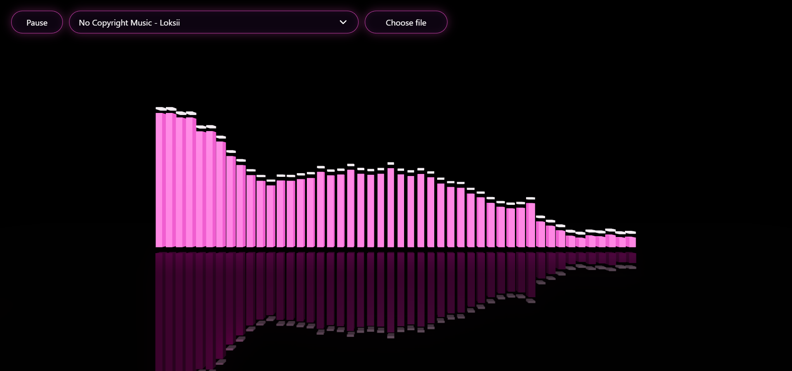

# Audio Visualizer

An interactive **3D audio visualizer** built with **React**, **TypeScript**, **Vite**, **React Three Fiber**, and the **Web Audio API**.

The application plays audio tracks, analyzes their frequency spectrum in real time, and renders animated bars in a stylized 3D scene. It supports both built-in tracks and custom file uploads, combining browser audio APIs, 3D rendering, animation smoothing, and UI controls in a single frontend project.

## Demo

[Live Demo](https://imkamie.github.io/audio-visualizer/)

## Preview



---

## Features

- **Real-time audio analysis** with the Web Audio API
- **Interactive 3D scene** built with React Three Fiber / Three.js
- **Animated frequency bars** driven by live analyser data
- **Peak indicators** for a more dynamic visual effect
- **Built-in track selection**
- **Custom audio upload**
- **Audio state shared through React Context**
- **Smooth bar rise / fall animation**
- **GitHub Pages deployment support** via Vite base path configuration

---

## Tech Stack

- **React**
- **TypeScript**
- **Vite**
- **React Three Fiber**
- **Three.js**
- **Web Audio API**
- **CSS**

---

## How It Works

The visualizer uses the **Web Audio API** to analyze the currently playing audio track in real time.

1. The app creates an `AudioContext` and an `AnalyserNode`.
2. The current audio track is connected to the analyser.
3. On each animation frame, the analyser provides frequency data as a `Uint8Array`.
4. Frequency values are normalized and mapped to the heights of the visual bars.
5. The 3D scene updates bar scales every frame to render the final visualizer effect.

The visual part of the project is built with **React Three Fiber**, which makes it possible to manage a Three.js scene using React components. Each bar updates according to the current audio spectrum, while animation smoothing creates a more natural motion.

To make the visualizer feel more dynamic, the animation uses separate behavior for:

- **rising bars** — faster response to new peaks
- **falling bars** — slower decay for smoother movement
- **peak markers** — separate falling speed for visual accents

---

## Getting Started

### 1. Clone the repository

```bash
git clone https://github.com/imkamie/audio-visualizer.git
cd audio-visualizer
```

### 2. Install dependencies

```bash
npm install
```

### 3. Start the development server

```bash
npm run dev
```

### 4. Build for production

```bash
npm run build
```

### 5. Preview the production build

```bash
npm run preview
```

---

## Deployment

This project is configured for **GitHub Pages** deployment.

Because the app is deployed under a repository subpath, Vite uses a custom base URL:

```ts
export default defineConfig({
  plugins: [react()],
  base: '/audio-visualizer/',
})
```

This ensures that assets and static files are resolved correctly after deployment.

---

## Challenges

Some practical challenges I worked through while building the project:

- separating audio logic from rendering logic so the project stays maintainable
- smoothing bar animation to avoid harsh jumps between analyser frames
- handling uploaded tracks without breaking the existing track selection flow
- tuning visual constants such as bar spacing, height scaling, and peak behavior
- configuring Vite correctly for deployment under a GitHub Pages repository path

---

## Future Improvements

Possible next steps for the project:

- add more visualization modes
- improve controls for uploaded tracks
- add progress / timeline UI
- add volume and mute controls
- introduce color themes or lighting presets
- improve mobile responsiveness
- optimize rendering and bundle size further
